# UIUC-Chan Suite

- [Hip With the Youth](#hip-with-the-youth)
- [An Unlikely Partnership](#an-unlikely-partnership)
- [The Weakest Link](#the-weakest-link)

## Hip With the Youth

Solver: `Aura` in `SpeedBambooFox`

```
Category: OSINT
Author: Emma
Points: 81/500
Solves: 567/958
```

### Challange description

> The Long Island Subway Authority (LISA), in an attempt to appeal to the younger generations, has begun experimenting with social media! See if you can find a way to a flag through their <font color="#FF0000">Instagram</font>.
>
> This is part one of a three-part OSINT suite including Hip With the Youth, An Unlikely Partnership, and The Weakest Link. I recommend starting here!

### Approach

From the challange description, I saw hints related to [Instagram](https://www.instagram.com/). Therefore, I first went to Instagram and tried searching for `Long Island Subway Authority`, where I found a user named `longislandsubwayauthority`.


After entering the `longislandsubwayauthority` [Instagram page](https://www.instagram.com/longislandsubwayauthority/) and checking their posts, I didn't find anything useful.

Then, I noticed there was a [Threads link](https://www.threads.net/@longislandsubwayauthority?xmt=AQGzk4xk-KvQOQ_WfPqnoBGd8_E4Qm_utylgimMVlDH_vFw) in the user's bio.

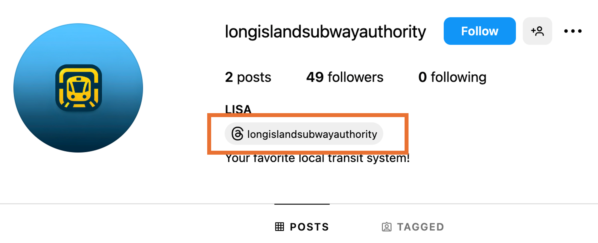

I visited the `longislandsubwayauthority` [Threads page](https://www.threads.net/@longislandsubwayauthority?xmt=AQGzk4xk-KvQOQ_WfPqnoBGd8_E4Qm_utylgimMVlDH_vFw) and looked around. I noticed a post with several replies.

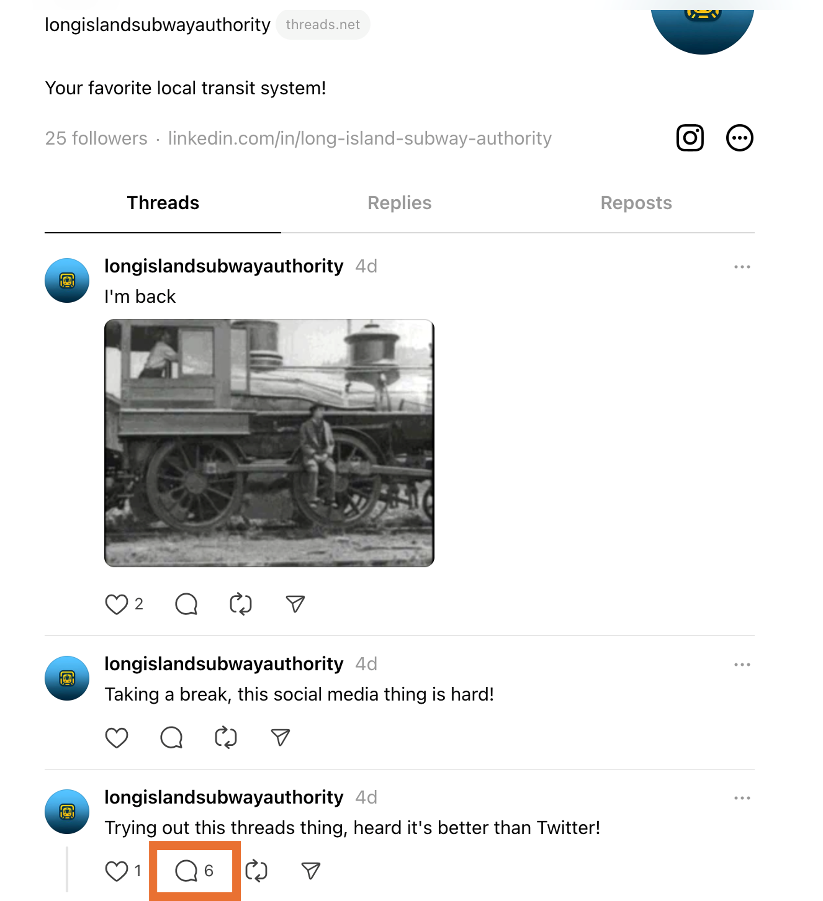

When I clicked into [one of their posts](https://www.threads.net/@longislandsubwayauthority/post/C8tAsAWRdIx?xmt=AQGzk4xk-KvQOQ_WfPqnoBGd8_E4Qm_utylgimMVlDH_vFw), I successfully found the flag.

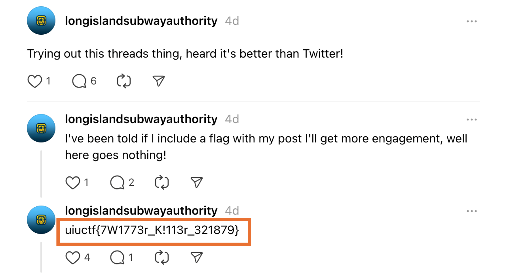

### Flag

`uiuctf{7W1773r_K!113r_321879}`

---

## An Unlikely Partnership

Solver: `Aura` in `SpeedBambooFox`

```
Category: OSINT
Author: Emma
Points: 100/500
Solves: 511/958
```

### Challange description

> It appears that the Long Island Subway Authority (LISA) has made <font color="#FF0000">a strategic business partnership</font> with a surprise influencer! See if you can figure out who.
>
> This is part two of a three-part OSINT suite including Hip With the Youth, An Unlikely Partnership, and The Weakest Link. This challenge is possible without Hip With the Youth but will be easier if you start there.

### Approach

Based on the challange description, the goal is to find the `hidden partner`. Continuing from the "Hip With the Youth" task, we can see a [Linkedin link](https://l.threads.net/?u=https%3A%2F%2Fwww.linkedin.com%2Fin%2Flong-island-subway-authority%2F&e=AT1t3naH_iQQ9KA3ZeMhDt_96r9WqMgHIkDpU-1iFpokGUcumbzrxrh79I2SavZZ4skUlrKyWjCTpGuCy4jsRZ12xdKUXSFeQw2EEXUhVdxK9FhLzgONYw3v3DacDGfT) in the profile of `longislandsubwayauthority` on Threads. Therefore, I went to the website to explore.


After entering the webpage, I read the user's "About", "Activity" ... section, and even checked out a [pinpoint](https://lnkd.in/pinpoint) post shared by the author, but I still couldn't find the keyword for the flag.

When I read the user's Skills, I noticed that they had 5 skills, and one of them was endorsed.

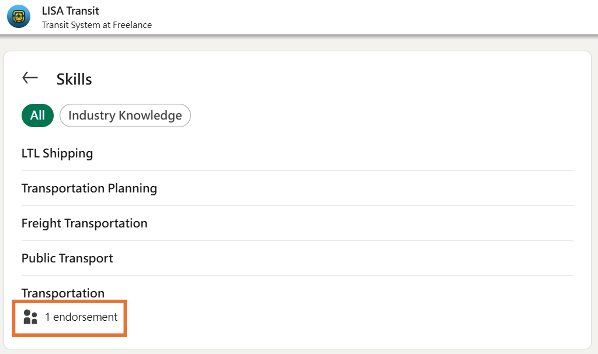

When I clicked on the endorsement, I discovered it was another user, so I clicked to explore further.

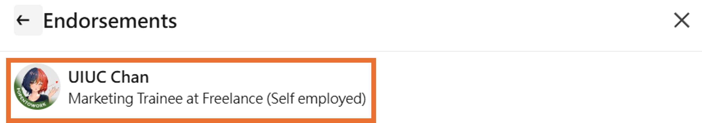

Upon entering that user's profile, the flag was right there in the "About" section.

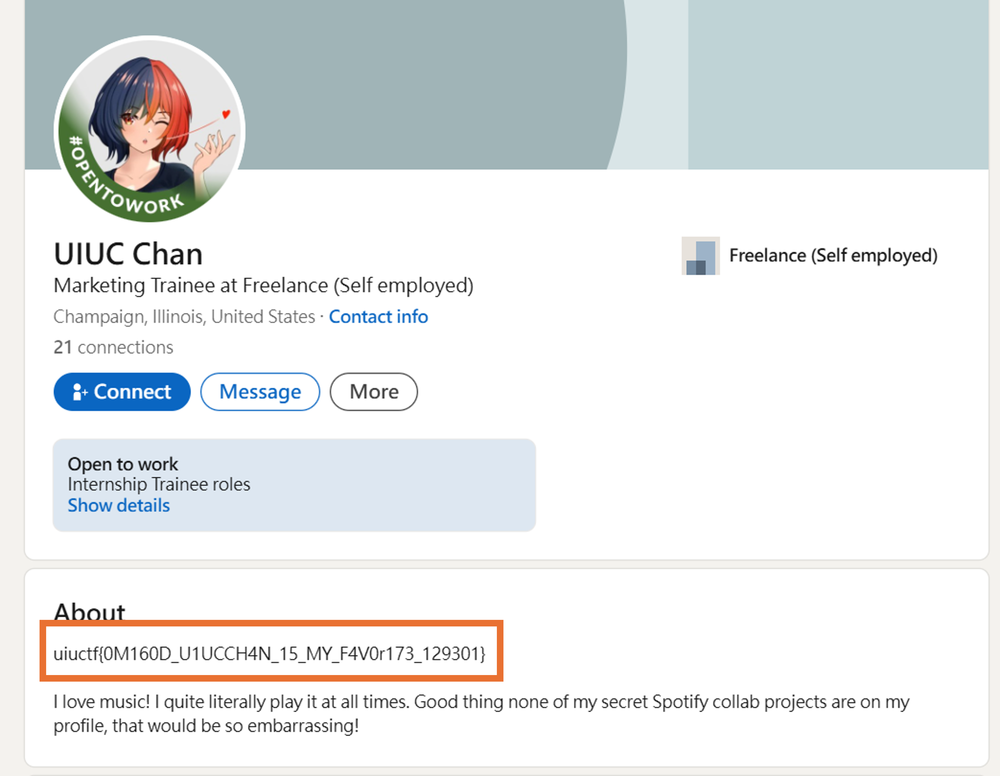

### Flag

`uiuctf{0M160D_U1UCCH4N_15_MY_F4V0r173_129301}`

## The Weakest Link

Solver: `Aura` in `SpeedBambooFox`

```
Category: OSINT
Author: Emma
Points: 393/500
Solves: 149/958
```

### Challange description

> LISA and the secret business partner have a secret <font color="#FF0000">Spotify</font> collaboration planned together. Unfortunately, neither of them have the opsec to keep it private. See if you can figure out what it is!
>
> This is part three of a three-part OSINT suite including Hip With the Youth, An Unlikely Partnership, and The Weakest Link. I recommend starting with the other two challenges!

### Approach

Based on the challange description, it seems that `LISA` and `UIUC Chan` might have a shared Spotify link, but where should I look for the Spotify entry point?

From [`UIUC Chan`'s LinkedIn page](https://www.linkedin.com/in/uiuc-chan), you can see some key phrases in the "About" section:

> I love music! I quite literally play it at all times. Good thing none of my secret Spotify collab projects are <font color="#FF0000">on my profile</font>, that would be so embarrassing!

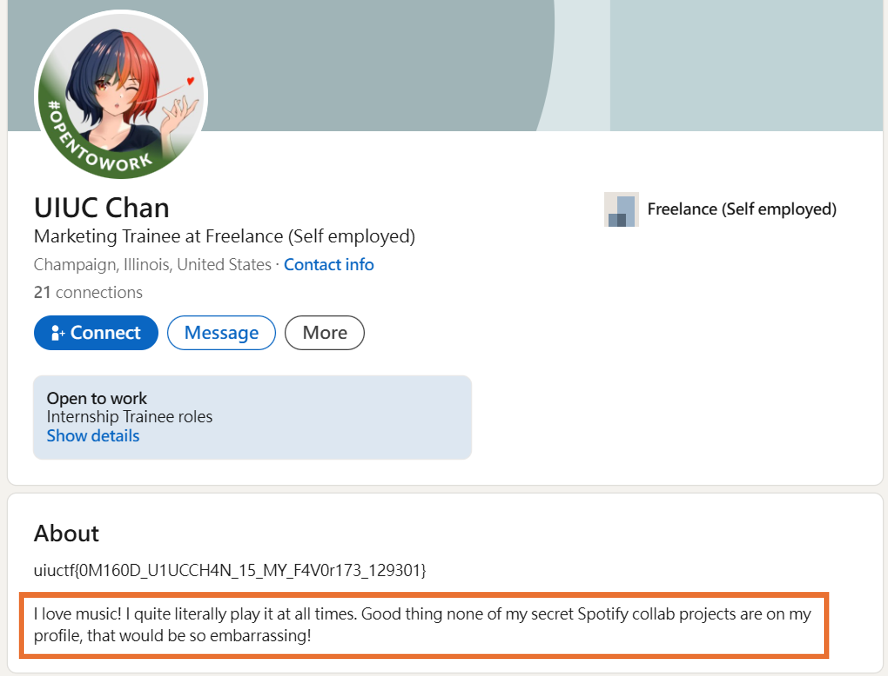

There’s a high chance the Spotify link is within their LinkedIn page. Finally, I found the [link](https://open.spotify.com/user/31d2lcivqdieyl4qzx25vfmp6jt4?si=b769b2466f7e4101) in the [contact info](https://www.linkedin.com/in/uiuc-chan/overlay/contact-info/?lipi=urn%3Ali%3Apage%3Ad_flagship3_profile_view_base%3BXiRnlb6yQHKZrNBuAnW2qg%3D%3D) section.

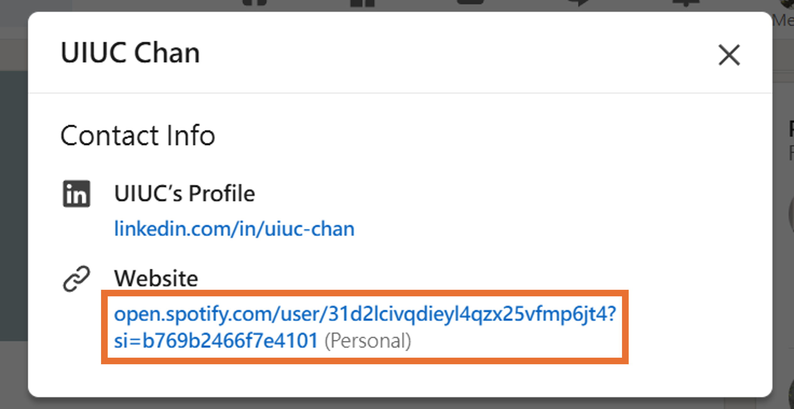

Upon entering Spotify, the first place I thought to check was the followers list to find `LISA` (though it might not be named `LISA`), and I did find a user named `Lisanetrasil`.

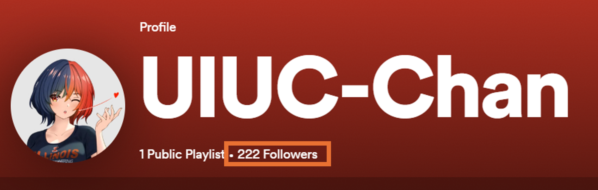
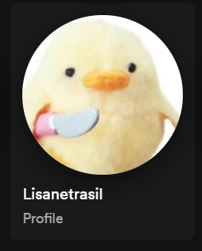

In [`Lisanetrasil`'s playlist](https://open.spotify.com/user/8qifrzc0txb07jrysf9kvmlvw), two names stood out to me: `X://` and `Metrobus`.


Although I tried searching on X, I didn’t find any useful information.

Returning to `UIUC Chan`’s Spotify link, I noticed they have a lot of followers, but `LISA` wasn't prominently displayed. I wondered if it was related to the following function.

Besides following user content, Spotify has a feature in the [Spotify App](https://www.spotify.com/tw/download/) to check friend activity.

I discovered that `UIUC Chan` was consistently listening to a playlist, and upon clicking on it, I found the flag in the playlist description, thus find the flag.

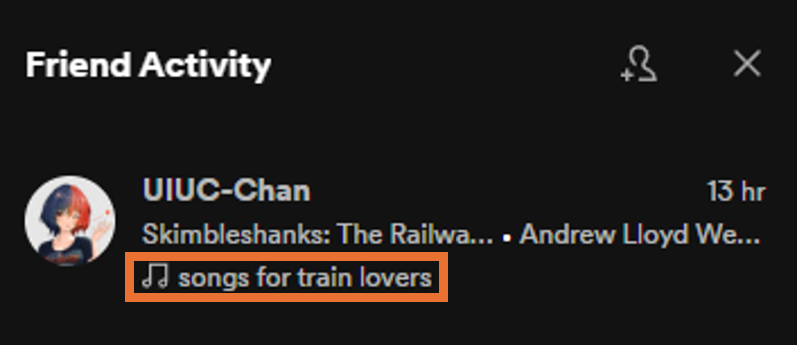

Finally, found the flag in the description under the playlist title.


### Flag

`uiuctf{7rU1Y_50N65_0F_7H3_5UMM3r_432013}`

## Reflection of these challenges

This series of challenges involves finding hidden information based on OSINT data to locate flags. `Hip With the Youth` and `An Unlikely Partnership` were relatively simple and straightforward to find. However, `The Weakest Link` required using the `Spotify App` to find the answer, which poses a significant challenge for participants who are not familiar with using Spotify.

I almost resorted to brute-forcing Spotify’s website to get the flag (panic.
