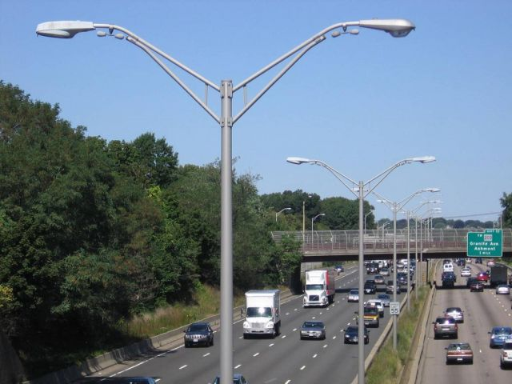
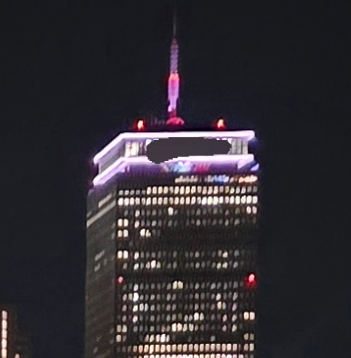
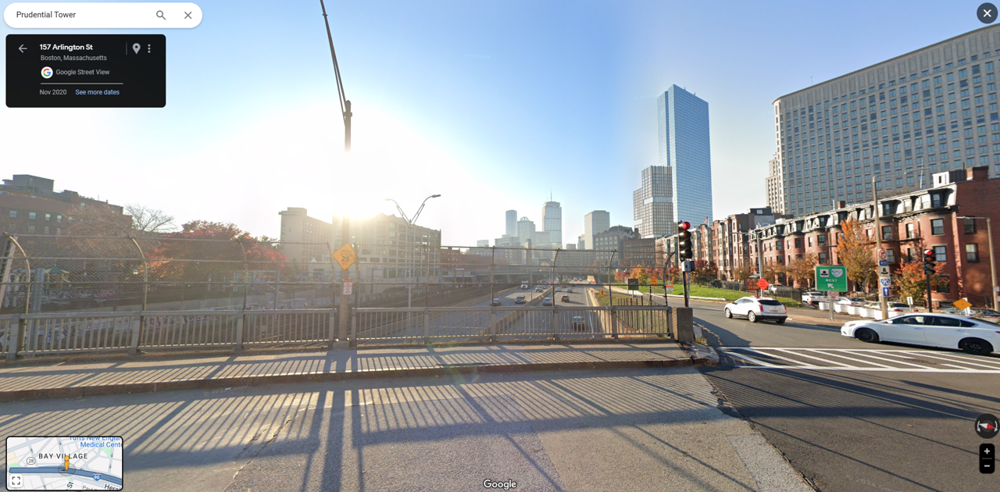
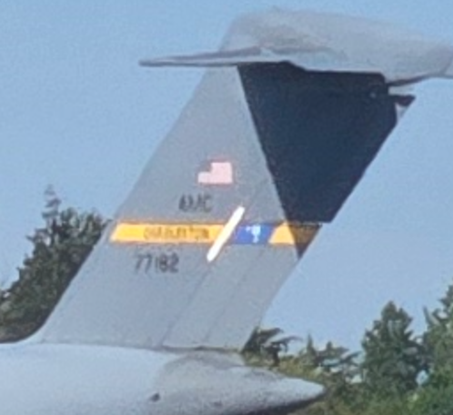
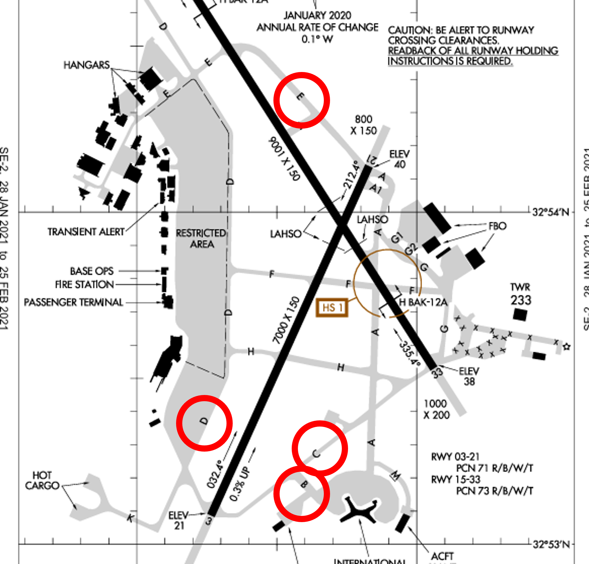
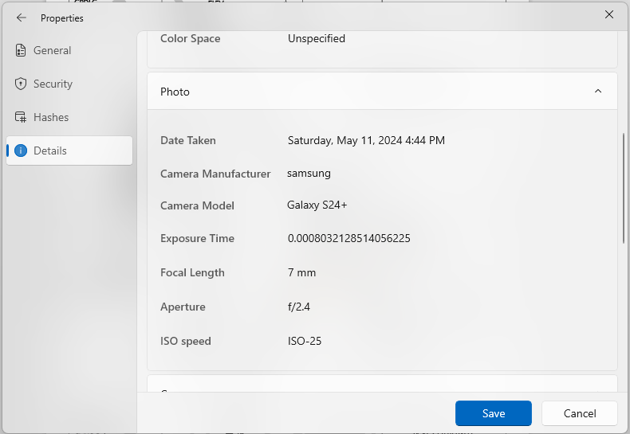
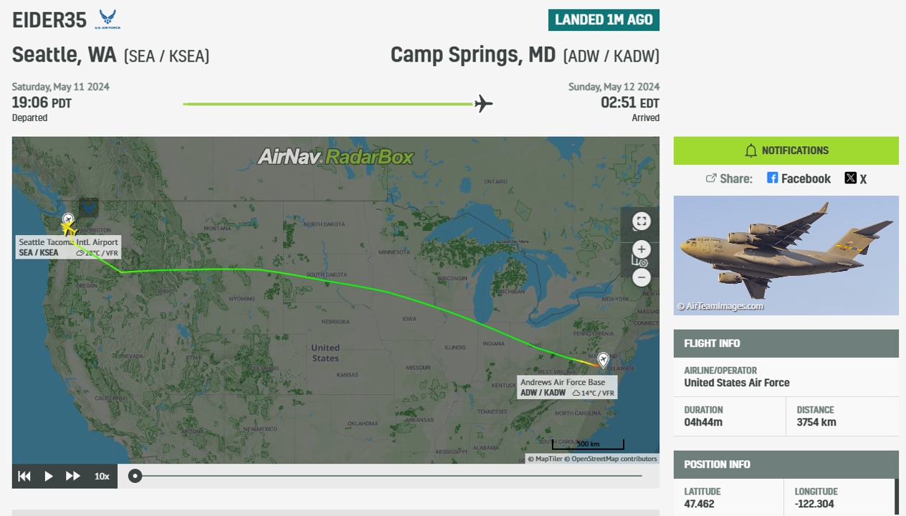

# Geoguesser Suite

- [Night](#night)
- [Chunky Boi](#chunky-boi)

## Night

Solver: `Aura`, `Hank` in `SpeedBambooFox`

```
Category: OSINT
Author: CBCicada
Points: 121/500
Solves: 466/958
```

### Challange description

> That was quite a pretty night view, can you find where I took it? Flag format: uiuctf{street name, city name} Example: uiuctf{East Green Street, Champaign}
> 
> Some words are blurred out to make the challenge harder, hopefully.
> 
> Flag format clarification: Use the full type, e.g. Avenue, Street, Road, etc., and include a space between the comma and city name.

### Attachment


### Approach

Upon seeing the photo, noticed the street lamp on the left side as a potential clue. Using Google's "Search by image", found that this street lamp can be found in `Boston` (though it's not guaranteed to be exclusive to `Boston`, starting the exploration there). The image below was found during the search.

> Location: I-95 highway, northbound to Boston, Massachusetts  
> 
>  [Reference](https://www.lighting-gallery.net/gallery/displayimage.php?album=687&pos=2096&pid=23806)

From the reference, inferred that this street lamp might appear on the highway, so started exploring the highways first. However, couldn't pinpoint the location due to a lack of distinct landmarks.

Returning to the challange photo, noticed a very bright building on the right in the background with signs of digital alteration. This building is likely a famous landmark. Using Google's "Search by image", identified it as the `Prudential Tower`[(Reference)](https://maps.app.goo.gl/YrNUvcK5XvQFkWw97).



With this landmark, quickly narrowed down the area. Noticing the railroad tracks on the left side of the photo helped further narrow down the area.


Next, checked all the streets near the highway using street view and finally identified `Arlington Street`[(Reference)](https://www.google.com/maps/@42.3479967,-71.0691271,3a,75y,256.28h,93.61t/data=!3m7!1e1!3m5!1sK3wQkx037cgBmBjOWjqO5g!2e0!6shttps:%2F%2Fstreetviewpixels-pa.googleapis.com%2Fv1%2Fthumbnail%3Fpanoid%3DK3wQkx037cgBmBjOWjqO5g%26cb_client%3Dmaps_sv.share%26w%3D900%26h%3D600%26yaw%3D256.2782651067718%26pitch%3D-3.6105969824865554%26thumbfov%3D90!7i16384!8i8192?coh=205410&entry=ttu) as the closest match to the original photo.



### Flag

`uiuctf{Arlington Street, Boston}`

## Chunky Boi

Solver: `Aura`, `Rasul` in `SpeedBambooFox`

```
Category: OSINT
Author: CBCicada, Emma
Points: 319/500
Solves: 225/958
```

### Challange description

> Now that's a BIG plane! I wonder where it is. Flag format: uiuctf{plane type, coordinates of the aircraft} Example: uiuctf{Airbus A380-800, 40.036, -88.264}
> 
> For coordinates, just omit the digits, do not round up. Precision is the same as the one in the example. The aircraft name is the same as Wikipedia page title. You can extract enough information from this image to answer this. You DO NOT need to register any accounts, all the information is public.
> 
> Flag format clarification: The last digit of the first coordinate is even, and the last digit of the second coordinate is odd.

### Attachment


### Approach

First, enlarge the photo. From the tail, it can be seen that the aircraft is numbered `77182`. A search shows it is named `Boeing C-17A Globemaster III`[(Reference)](https://www.flightradar24.com/data/aircraft/07-7182), but according to the problem statement, Wikipedia should be the primary source. Therefore, it should be `Boeing C-17 Globemaster III` [(Reference)](https://en.wikipedia.org/wiki/Boeing_C-17_Globemaster_III).



According to the aircraft information, first, search for its last flight record [(Reference)](https://www.radarbox.com/data/registration/07-7182). The last flight record of the aircraft is on `June 27, 2024`, from `Meggett, United States` to `Charleston, SC, United States`. 

With the landing point likely being `Charleston International Airport`[(Reference)](https://maps.app.goo.gl/nB7toKqfKjAdp2vK7). The record also shows a final set of coordinates `(32.922, -80.063)`, but submitting the flag with these coordinates was incorrect.


Considering the objective is to find the location of the aircraft in the photo rather than the landing point, search for the airport map of `Charleston International Airport`[(Reference)](https://upload.wikimedia.org/wikipedia/commons/c/ce/CHS_FAA_Diagram.pdf). The target photo shows BCDE runways nearby, but at `Charleston International Airport`, the **E** track is far from **B,C,D** track, suggesting it might not be this airport.




Next, think about where to find the timestamp of the photo. The photo's metadata indicates it was taken on `May 11, 2024`.



With this information, investigate the flight records of the `Boeing C-17 Globemaster III` on `May 11, 2024`. From this [website](https://www.ads-b.nl/aircraft.php?id_aircraft=11411651&pagenum=11&selectmove=day&movedate=2024-05-08&whatinfo=All), it can be determined that the aircraft was also known as `EIDER35`. Using this data, return to the [flight tracking website](https://www.radarbox.com/) to successfully find the flight record of this aircraft on `May 11, 2024` [(Reference)](https://www.radarbox.com/data/flights/EIDER35/2154338060).



The data shows the aircraft flew from `Seattle, WA` to `Camp Springs, MD`. Therefore, investigate the departure point, Seattle–Tacoma International Airport [(Reference)](https://maps.app.goo.gl/KSQ4pQN4jwdoSgBb6).

The airport map [(Reference)](https://upload.wikimedia.org/wikipedia/commons/e/ee/KSEA_Airport_Diagram.pdf) shows that the **B,C,D,E** tracks are very close to each other, suggesting this is likely the airport. The green dot below is the photo's location, and the blue dot is the aircraft's location.


Finally, using Google Maps to find this location at `Seattle–Tacoma International Airport`, the final coordinates of the aircraft in the photo are obtained.


### Flag

`uiuctf{Boeing C-17 Globemaster III, 47.462, -122.303}`

## Reflection of these challenges

Unlike the UIUC-Chan Suite, these answers are not direct flags, requiring more time to search and involving many incorrect attempts. However, this closely resembles what is done in real data forensics: extracting useful information from an image, using appropriate tools for searching, and finding the final answer.

Unfortunately, the New Dallas challenge was not solved. Although it was identified that the blue license plate was likely from China and efforts were made to search for elevated metro systems, too much time was spent looking in Shenzhen. There is also a Phoenix City, which added to the confusion. Despite this, the challenges in this section were very interesting.
